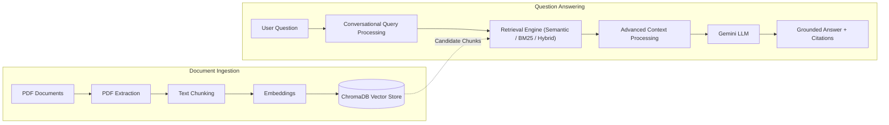
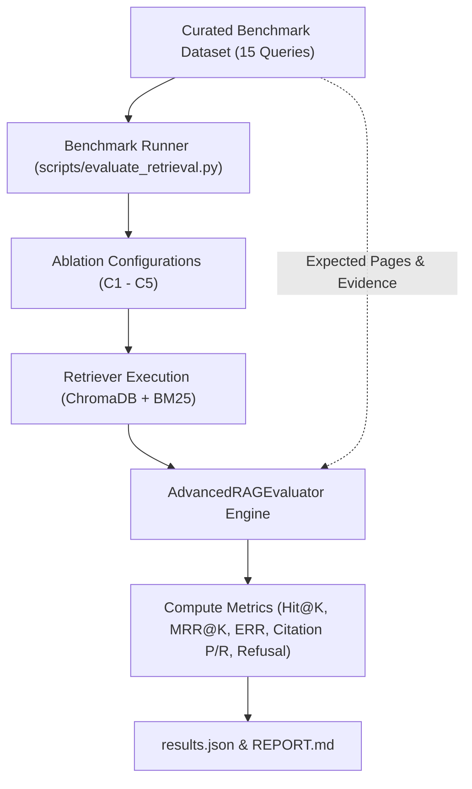

# ContextIQ

### RAG-Powered Multi-Document Intelligence System

A Python-based document intelligence system that combines Retrieval-Augmented Generation, hybrid information retrieval, conversational query processing, and quantitative RAG evaluation for grounded question answering over multiple PDF documents.

[](https://www.python.org/)
[](https://streamlit.io/)
[](https://www.trychroma.com/)
[](https://ai.google.dev/)


---

## 1. Overview

**ContextIQ** allows users to upload multiple PDF documents, index their text into a local vector database, ask natural-language questions, retrieve relevant document passages, and generate answers grounded in verified evidence.

Every response includes document and page-level citations, accompanied by an interactive inspection drawer for verifying raw text chunks, similarity metrics, and ranking scores. The system is built with a decoupled architecture using **Python**, **Streamlit**, **Google Gemini**, **ChromaDB**, and a **hybrid retrieval** engine combining semantic dense search with lexical BM25 ranking.

---

## 2. Why ContextIQ?

Standard large language models generate answers based solely on parametric pre-training weights. When queried about private or domain-specific documents, they cannot access unpublished material and may produce unsupported statements without referenceable evidence.

ContextIQ solves this by enforcing a Retrieval-Augmented Generation (RAG) workflow:

$$\text{User Question} \longrightarrow \text{Retrieve Relevant Evidence} \longrightarrow \text{Inject Context into Prompt} \longrightarrow \text{Generate Answer} \longrightarrow \text{Display Citations}$$

This evidence-first design reduces reliance on unsupported model knowledge and ensures every generated claim can be audited directly against the original source document and page number.

---

## 3. Key Features

### Document Intelligence
- **Multi-PDF Ingestion**: Upload, index, and query multiple PDF files simultaneously.
- **PyMuPDF Text Extraction**: Robust page-by-page text extraction and whitespace normalization.
- **Configurable Chunking**: Sliding-window text chunker with user-defined size (default: 1,000 chars) and overlap (default: 200 chars).
- **Parent/Child Chunking**: Dual-granularity chunking producing small child chunks linked to larger parent sections (default: 2,000 chars).
- **SHA-256 Document Identity**: Content-based hashing prevents duplicate uploads and avoids filename collisions.
- **Document Management**: View indexed file statistics and delete individual documents cleanly from ChromaDB.
- **Persistent Indexing**: Automatic disk persistence using ChromaDB.

### Information Retrieval
- **Gemini Embeddings**: High-dimensional dense vector embeddings (`gemini-embedding-001`, 768 dimensions).
- **Semantic Vector Search**: Cosine distance similarity search over chunk vectors.
- **BM25 Keyword Search**: In-memory Okapi BM25 index for exact terminology and code identifiers.
- **Hybrid Search via RRF**: Fuses dense vector ranks and lexical BM25 ranks using Reciprocal Rank Fusion ($k=60$).
- **Similarity Threshold Filtering**: Drops low-relevance candidates falling below a similarity cutoff (default: 0.50).
- **Document Filtering**: Restrict retrieval queries to specific selected documents or search across the entire library.
- **Top-K Retrieval**: Configurable candidate pool depth (default: 5).

### Advanced RAG Capabilities
- **Conversation Memory**: Tracks multi-turn dialogue history within a session-isolated window (up to 6 turns).
- **Context-Aware Query Rewriting**: Reformulates follow-up queries and ambiguous pronouns into standalone search queries.
- **Query Expansion**: Optional multi-query generation (up to 3 queries) to broaden vocabulary coverage across candidate pools.
- **TF-IDF Reranking**: Optional candidate re-scoring ($3 \times \text{top\_k}$ pool) using lexical TF-IDF cosine similarity.
- **Parent Context Resolution**: Matches precise child chunks and substitutes enclosing parent sections for prompt context.
- **Extractive Context Compression**: Selects the most query-relevant sentences per chunk in chronological order (default: max 7 sentences, threshold 0.05).
- **Retrieval Inspector Drawer**: Collapsible UI component displaying raw chunks, distances, BM25 scores, and fusion ranks.
- **Source Provenance**: Explicit `(source, page)` badges attached to every response.

### Quantitative Evaluation
- **Retrieval Metrics**: Measures Hit@K, Recall@K, and MRR@K ($K \in \{3, 5\}$).
- **Context Efficiency**: Quantifies context reduction percentage and strict Evidence Retention Rate (ERR).
- **Provenance & Robustness**: Calculates citation precision, citation recall, and refusal accuracy on unanswerable queries.
- **Ablation Framework**: CLI benchmark tool running standardized C1–C5 ablation comparisons with zero live API calls required during automated testing.

---

## 4. ContextIQ Evolution: V1 → V2

ContextIQ evolved through structured engineering phases, progressing from a baseline prototype to a modular multi-document architecture:

| Capability Area | ContextIQ V1 (Baseline Prototype) | ContextIQ V2 (Advanced Modular System) |
| :--- | :--- | :--- |
| **Document Ingestion** | Single PDF upload, standard character chunking | Multi-PDF upload, SHA-256 duplicate detection, hierarchical parent/child chunking |
| **Vector Storage** | Ephemeral or single-doc collection | Multi-document ChromaDB store with isolated IDs and document-level deletion |
| **Retrieval Engine** | Dense vector semantic search only | Three selectable modes: Semantic, Okapi BM25, and Hybrid RRF ($k=60$) |
| **Filtering & Scope** | Fixed Top-K retrieval | Document-specific filtering + Cosine similarity threshold cutoff (default: 0.50) |
| **Dialogue Handling** | Single-turn independent questions | Multi-turn conversation memory with context-aware LLM query rewriting |
| **Ranking & Context** | Raw Top-K chunks passed directly to LLM | Candidate deduplication, TF-IDF reranking, parent context resolution, context compression |
| **Answer Generation** | Generic prompt with retrieved text | Strict grounding prompt with document and page provenance citations |
| **Inspection & Debug** | Terminal logs only | Interactive UI drawer with raw chunks, distances, BM25 scores, and RRF ranks |
| **Evaluation System** | Qualitative spot-checking | Automated deterministic evaluation framework (Hit@K, MRR@K, ERR, C1–C5 ablation) |

---

## 5. System Architecture

### High-Level Architecture



---

### Architecture Flow

The system operates across two distinct runtime workflows:

1. **Document Ingestion Workflow**: When PDFs are uploaded, ContextIQ validates file bytes, calculates SHA-256 document identities to prevent duplicate storage, extracts clean text page-by-page using PyMuPDF, chunks content into overlapping segments (or hierarchical parent/child pairs), generates 768-dimensional embeddings via Google Gemini, and persists records into local ChromaDB storage.
2. **Question Answering Workflow**: When a query is submitted, ContextIQ uses conversational history to reformulate follow-up questions, executes retrieval (Semantic, BM25, or Hybrid with RRF fusion), filters candidates by similarity threshold and document selection, deduplicates chunks, applies optional reranking, parent resolution, and sentence compression, and prompts Gemini to synthesize a grounded response with document and page citations.

---

### Detailed Query Orchestration Pipeline

The diagram below details the exact execution order implemented in `app/rag/pipeline.py`:

```mermaid
flowchart TD
    subgraph Ingestion["Document Ingestion Flow"]
        PDF["PDF Documents"] --> Loader["PDFLoader (PyMuPDF)"]
        Loader --> Chunker["TextChunker / ParentChildChunker"]
        Chunker --> Hash["SHA-256 Duplicate Check"]
        Hash --> Embedder["GeminiEmbedder (gemini-embedding-001)"]
        Embedder --> ChromaDB[("ChromaDB Vector Store")]
    end

    subgraph QueryPipeline["Query Orchestration Flow (app/rag/pipeline.py)"]
        UserQ["User Question"] --> History{"Conversation History?"}
        History -- "Yes" --> Rewriter["QueryRewriter (Gemini)"]
        History -- "No" --> CleanQ["Clean Question"]
        Rewriter --> ExpandedCheck{"Query Expansion Enabled?"}
        CleanQ --> ExpandedCheck

        ExpandedCheck -- "Yes" --> Expander["QueryExpander (Gemini / Offline)"]
        ExpandedCheck -- "No" --> SingleQuery["Single Search Query"]

        Expander --> Retrieval["Multi-Query Retrieval"]
        SingleQuery --> Retrieval

        Retrieval --> ModeSelect{"Retrieval Mode"}
        ModeSelect -- "Semantic" --> Dense["Dense Vector Search"]
        ModeSelect -- "BM25" --> Lexical["Okapi BM25 Search"]
        ModeSelect -- "Hybrid" --> Fusion["Dense + BM25 + Reciprocal Rank Fusion"]

        Dense --> Filter["Similarity Threshold & Document Filtering"]
        Lexical --> Filter
        Fusion --> Filter

        Filter --> Dedup["Candidate Deduplication (Highest Score Wins)"]
        Dedup --> RerankCheck{"Reranker Enabled?"}
        RerankCheck -- "Yes" --> Reranker["TF-IDF Candidate Reranker"]
        RerankCheck -- "No" --> TopK["Select Top-K"]
        Reranker --> TopK

        TopK --> ParentCheck{"Parent/Child Enabled?"}
        ParentCheck -- "Yes" --> ParentResolver["Resolve Parent Contexts"]
        ParentCheck -- "No" --> ChunksReady["Retrieved Chunks"]
        ParentResolver --> ChunksReady

        ChunksReady --> CompCheck{"Context Compression Enabled?"}
        CompCheck -- "Yes" --> Compressor["ExtractiveContextCompressor"]
        CompCheck -- "No" --> FinalContext["Final Context Chunks"]
        Compressor --> FinalContext

        FinalContext --> Generator["Gemini Generator"]
        Generator --> Output["Grounded Answer + Sources (Document & Page)"]
    end
```



---

## 6. Core Components

The following table lists the primary modules and their responsibilities across the application:

| Component | Source Module | Primary Responsibility |
| :--- | :--- | :--- |
| `PDFLoader` | `app/ingestion/pdf_loader.py` | Extracts page-by-page text and metadata from PDF files using PyMuPDF. |
| `TextChunker` | `app/ingestion/chunker.py` | Segments extracted document pages into sliding-window character chunks with overlap. |
| `ParentChildChunker` | `app/ingestion/parent_chunker.py` | Builds hierarchical chunks containing small child chunks linked to larger parent sections. |
| `GeminiEmbedder` | `app/ingestion/embedder.py` | Generates 768-dimensional dense vector embeddings using Google GenAI SDK. |
| `ChromaVectorStore` | `app/vectorstore/chroma_store.py` | Manages local persistent vector storage and cosine similarity querying in ChromaDB. |
| `Retriever` | `app/retrieval/retriever.py` | Coordinates semantic vector search, BM25 keyword search, and hybrid Reciprocal Rank Fusion. |
| `BM25Index` | `app/retrieval/bm25.py` | Maintains an in-memory Okapi BM25 keyword index for exact lexical term matching. |
| `Conversation` | `app/rag/conversation.py` | Stores session-isolated chat history and computes sliding-window turn context. |
| `QueryRewriter` | `app/rag/query_rewriter.py` | Reformulates conversational follow-up questions into standalone retrieval queries. |
| `GeminiQueryExpander` | `app/rag/query_expander.py` | Generates alternative search queries via Gemini to broaden candidate pool coverage. |
| `TFIDFReranker` | `app/retrieval/reranker.py` | Re-ranks candidate chunk pools using pure-Python lexical TF-IDF cosine similarity. |
| `resolve_parent_context` | `app/retrieval/parent_context.py` | Expands retrieved child chunks into parent sections while deduplicating shared parents. |
| `ExtractiveContextCompressor` | `app/retrieval/compressor.py` | Filters retrieved chunks down to the most query-relevant sentences in chronological order. |
| `RAGPipeline` | `app/rag/pipeline.py` | Orchestrates the end-to-end query flow from query processing to generation. |
| `GeminiGenerator` | `app/generation/generator.py` | Constructs grounded system prompts and generates cited answers using Gemini. |
| `AdvancedRAGEvaluator` | `app/evaluation/retrieval_evaluator.py` | Computes quantitative IR, context reduction, evidence retention, and citation metrics. |
| `EvaluationDashboard` | `app/ui/eval_dashboard.py` | Renders interactive Streamlit benchmark dashboard visualizing ablation matrices, charts, and queries. |

---

## 7. Retrieval Strategies

ContextIQ allows users to toggle between three core retrieval strategies directly in the UI:

| Strategy | Mechanism | Primary Strength |
| :--- | :--- | :--- |
| **Semantic** | Cosine distance over dense vector embeddings | Captures high-level concepts, paraphrases, and meaning |
| **BM25** | Exact lexical term frequency / inverse document frequency | Matches exact technical terms, acronyms, and identifiers |
| **Hybrid (RRF)** | Merges rankings using Reciprocal Rank Fusion: $\sum \frac{1}{60 + \text{rank}}$ | Combines semantic coverage with keyword precision |

- **Semantic search** targets conceptual relevance.
- **BM25 search** targets exact keyword matches.
- **Hybrid search** captures both signals simultaneously. On the evaluation dataset, Hybrid search delivered the strongest baseline retrieval performance.

---

## 8. Advanced RAG Features

All advanced RAG modules are optional toggles in the sidebar, allowing users and developers to evaluate their impact independently:

- **Query Expansion**: Generates alternative search queries to improve recall when documents use different phrasing.
- **TF-IDF Reranking**: Re-orders retrieved candidates based on lexical term-frequency overlap against the user query.
- **Parent/Child Retrieval**: Indexes small child chunks for precise vector matching while passing larger enclosing parent sections to the generator.
- **Extractive Context Compression**: Filters chunk sentences down to the most query-relevant sentences before generation, reducing context size.
- **Conversation Memory**: Maintains multi-turn context to resolve follow-up questions (e.g., *"How do I implement it?"*) into complete, unambiguous search queries.
- **Runtime Latency & Performance Tracking**: Measures live per-stage execution times (query rewrite, expansion, retrieval, reranking, parent expansion, compression, generation) with high-resolution timers (`time.perf_counter()`), surfaced in an expandable *Performance* drawer per chat turn. (Note: live runtime observability is kept strictly separate from offline evaluation benchmarks).

---

## 9. Tech Stack

| Area | Technology | Purpose |
| :--- | :--- | :--- |
| **Language** | Python 3.10+ | Core language across all modules |
| **UI Framework** | Streamlit | Reactive web dashboard, sidebar controls, and inspection drawers |
| **RAG Architecture** | Custom Modular Pipeline | Decoupled orchestrator implemented without LangChain or LangGraph |
| **LLM API** | Google Gemini (`google-genai` SDK) | Grounded generation and conversational query rewriting |
| **Generation Model** | `gemini-3.5-flash-lite` | Structured prompt synthesis with grounding guardrails |
| **Embedding Model** | `gemini-embedding-001` | 768-dimensional dense vector representations |
| **Vector Database** | ChromaDB | Local persistent vector storage via SQLite backend |
| **PDF Extraction** | PyMuPDF (`fitz`) | Fast, accurate document parsing and page text extraction |
| **Semantic Retrieval** | Dense Vector Cosine Similarity | Meaning-based similarity search |
| **Keyword Retrieval** | Custom Okapi BM25 | In-memory tokenized lexical keyword matching |
| **Rank Fusion** | Reciprocal Rank Fusion (RRF, $k=60$) | Scale-independent ranking combination |
| **Reranking** | Custom Pure-Python TF-IDF | Candidate pool re-scoring by query term overlap |
| **Context Optimization** | Hierarchical Parent/Child + Sentence Extraction | Token budget reduction and narrative context preservation |
| **Configuration** | `python-dotenv` | Centralized environment variable management |
| **Testing** | `pytest` | 22 test modules covering unit, integration, and regression suites |
| **Evaluation** | Custom Deterministic Evaluation Framework | Offline benchmarking against verified ground-truth dataset |
| **Version Control** | Git / GitHub | Branch-based development and tracking |

---

## 10. How ContextIQ Works

1. **Upload**: The user uploads one or more PDF files via the web interface.
2. **Text Processing**: Text is extracted page-by-page, chunked with overlap, and indexed with SHA-256 identity hashes.
3. **Embedding**: Chunks are transformed into 768-dimensional vectors and stored locally in ChromaDB.
4. **Query Formulation**: When a question is asked, conversation history is used to rewrite follow-ups into standalone queries.
5. **Multi-Strategy Retrieval**: The system executes Semantic search, BM25 keyword search, or Hybrid search (RRF) to retrieve candidate chunks.
6. **Refinement**: Optional modules re-score candidates via TF-IDF, expand child chunks to parent context, and extractively compress sentences.
7. **Generation**: The language model generates an answer strictly grounded in the selected context, returning verified document and page citations.

---

## 11. Project Structure

```text
ContextIQ-RAG/
├── app/
│   ├── config.py                 # Configuration and environment defaults
│   ├── main.py                   # Streamlit web application
│   ├── evaluation/               # Metrics computation (Hit@K, Recall@K, MRR, ERR)
│   ├── generation/               # Grounded prompt construction and Gemini client
│   ├── ingestion/                # PDF loader, character chunker, parent chunker, embedder
│   ├── rag/                      # Pipeline orchestrator, conversation memory, query rewriter/expander
│   ├── retrieval/                # Retriever (Semantic/BM25/Hybrid), TF-IDF reranker, compressor
│   ├── ui/                       # Streamlit layout, inspection drawers, and badges
│   └── vectorstore/              # ChromaDB persistent collection wrapper
├── evaluation/
│   ├── README.md                 # Evaluation documentation and usage instructions
│   ├── REPORT.md                 # Generated ablation benchmark report
│   ├── results.json              # Machine-readable per-query evaluation data
│   └── retrieval_dataset.json    # 15 ground-truth evaluation queries
├── scripts/
│   ├── dump_chunks.py            # Diagnostic chunk viewer
│   ├── evaluate_retrieval.py     # CLI ablation benchmark runner
│   └── list_chunks.py            # Document index summary utility
├── tests/                        # 22 test modules (316 unit & integration tests)
├── .env.example                  # Environment configuration template
├── requirements.txt              # Project dependencies
├── run.py                        # Streamlit application launcher
└── README.md                     # Project documentation
```

---

## 12. Installation & Setup

### Prerequisites
- Python 3.10, 3.11, 3.12, or 3.13
- A Google Gemini API key ([Google AI Studio](https://aistudio.google.com/))

### 1. Clone the Repository
```powershell
git clone https://github.com/NithushanUthayarasa/ContextIQ-RAG-System.git
cd ContextIQ-RAG-System
```

### 2. Set Up a Virtual Environment
```powershell
# Windows (PowerShell)
python -m venv .venv
.venv\Scripts\activate

# Linux / macOS
python3 -m venv .venv
source .venv/bin/activate
```

### 3. Install Dependencies
```powershell
pip install -r requirements.txt
```

### 4. Configure Environment Variables
Copy the template environment file:
```powershell
cp .env.example .env
```
Add your Gemini API key inside `.env`:
```ini
GEMINI_API_KEY=your_actual_gemini_api_key_here
```

### 5. Launch the Application
Run using Streamlit:
```powershell
streamlit run app/main.py
```
Or via the launcher script:
```powershell
python run.py
```
Open `http://localhost:8501` in your browser.

---

## 13. How to Use

1. **Upload Documents**: Drag and drop one or more PDF files into the sidebar upload section.
2. **Indexing**: ContextIQ extracts text, chunks content, computes embeddings, and stores vectors.
3. **Select Retrieval Strategy**: Choose **Semantic**, **BM25**, or **Hybrid** in the sidebar.
4. **Filter Scope (Optional)**: Filter search to specific documents or adjust the similarity threshold.
5. **Toggle Advanced Modules (Optional)**: Enable Query Expansion, TF-IDF Reranking, Parent/Child Retrieval, or Context Compression.
6. **Submit Question**: Enter a query in the chat input. Follow-up queries utilize conversation memory.
7. **Inspect Output**: View the grounded response, check source and page badges, and open the *Retrieved Context Inspector* to examine chunk scores.
8. **Inspect Benchmarks**: Switch to the **📊 Evaluation Dashboard** tab to view quantitative ablation matrices, interactive performance charts (Hit@K, MRR, Context Reduction, Evidence Retention), query-level results, and export benchmark data.

### Example Walkthrough
- **Question**: *"What are the three parts of a JSON Web Token (JWT) structure?"*
- **Execution**: The query retrieves relevant slide sections from the indexed lecture document.
- **Result**: The LLM synthesizes an answer directly citing `Header`, `Payload`, and `Signature` with provenance referencing `Page 43`.

---

## 14. Quantitative Evaluation

ContextIQ avoids subjective assessments of answer quality by incorporating an automated quantitative benchmark harness (`scripts/evaluate_retrieval.py`). The dataset comprises 15 verified queries mapped to an indexed lecture presentation (`SE3090 Lecture 04 Database Auth Integration.pdf`).

### Offline Evaluation Architecture

The evaluation harness operates as a dedicated benchmark system separate from live chat inference:



---

### Current Benchmark Results (15 Curated Queries)

| Configuration | Description | Hit@3 | Hit@5 | MRR@5 | Recall@5 | Avg Chars | Red % | Evidence Retention (ERR) | Citation Prec |
| :--- | :--- | :---: | :---: | :---: | :---: | :---: | :---: | :---: | :---: |
| **C1_Hybrid_Baseline** | Hybrid (Semantic + BM25 + RRF) | **0.917** | **1.000** | **0.938** | **0.958** | 3,650 | 0.0% | 100.0% | **0.287** |
| **C2_Hybrid_Reranked** | Hybrid + TF-IDF Reranking | 0.750 | 0.917 | 0.708 | 0.792 | 3,298 | 0.0% | 100.0% | 0.212 |
| **C3_Hybrid_Rerank_Expanded** | Hybrid + TF-IDF + Offline Expansion | 0.750 | 0.750 | 0.667 | 0.667 | 3,343 | 0.0% | 100.0% | 0.175 |
| **C4_Hybrid_Rerank_ParentChild** | Hybrid + Rerank + Parent Resolution | 0.750 | 0.917 | 0.708 | 0.792 | 3,298 | 0.0% | 100.0% | 0.212 |
| **C5_Full_Advanced_RAG** | Full: Hybrid + Rerank + Parent + Compress | 0.750 | 0.917 | 0.708 | 0.792 | **973** | **70.3%** | **61.1%** | 0.212 |

*Data source: `evaluation/results.json` and `evaluation/REPORT.md`.*

---

## 15. Benchmark Analysis & Engineering Findings

Quantitative benchmarking reveals practical insights about RAG pipelines:

1. **Hybrid Baseline is Strongest**: The combination of dense vectors and BM25 using Reciprocal Rank Fusion yielded the highest retrieval accuracy on this corpus (Hit@5 = 1.000, MRR@5 = 0.938).
2. **TF-IDF Reranking Limitations on Sparse Slides**: TF-IDF reranking decreased MRR@5 from 0.938 to 0.708. In slide decks, high-level overview slides repeat technical keywords multiple times, causing lexical TF-IDF to score outline slides above detailed conceptual slides. This demonstrates that adding rerankers does not automatically improve retrieval on all document formats.
3. **Offline vs. Production Query Expansion**: Benchmarking uses `DeterministicQueryExpander` for zero-cost, offline reproducibility. Rule-based expansion did not benefit this small dataset, whereas production runtime uses `GeminiQueryExpander` for context-aware semantic reformulations.
4. **Context Compression Trade-Off**: Context compression achieved a **70.3% character reduction** (down from 3,298 to 973 average characters), conserving prompt space. However, strict evidence retention was **61.1%**, as concise bullet fragments lacking query term overlap were excluded.
5. **Corpus Scope**: The benchmark is evaluated on one lecture presentation with 15 curated queries. These results reflect this specific document format and should not be generalized to long-form prose or diverse datasets.

---

## 16. Evaluation & Benchmark Commands

### Run the Evaluation Benchmark
```powershell
python scripts/evaluate_retrieval.py --ablation
```
Generated outputs:
- `evaluation/results.json` (machine-readable metrics per query)
- `evaluation/REPORT.md` (formatted markdown benchmark report)

---

## 17. Testing

The codebase includes comprehensive unit and integration tests across all ingestion, retrieval, ranking, compression, and pipeline modules.

```powershell
python -m pytest -q
```

*Current verified development state: **338 tests passing, 0 failures** (100% offline with zero external API calls).*

---

## 18. Key Engineering Decisions

- **Local Vector Storage**: ChromaDB was selected to provide self-contained, disk-persistent vector search without external service dependencies.
- **SHA-256 Document Identity**: File content hashing guarantees deterministic document IDs and prevents duplicate vector entries.
- **Dual Retrieval Signals**: BM25 keyword matching complements dense vector search, ensuring exact technical acronyms and code terms are captured.
- **Reciprocal Rank Fusion**: RRF merges scores based on ordinal ranks, avoiding calibration issues between cosine distances and unbounded BM25 scores.
- **Extractive Sentence Compression**: Local sentence extraction avoids the latency and monetary cost of an additional generative LLM call.
- **Modular Ablation Toggles**: Advanced RAG modules are fully decoupled and toggleable to enable rigorous ablation testing.
- **Deterministic Evaluation**: Testing and benchmark runs execute entirely offline with deterministic mocks, ensuring reliable CI verification.

---

## 19. System Limitations

- **Lexical Reranker**: TF-IDF reranking is strictly lexical and cannot evaluate semantic context or synonyms.
- **Compression Trade-Off**: Extractive sentence scoring can omit short bullet points that lack direct word overlap with the query.
- **Single-Corpus Benchmark**: The automated benchmark is currently calibrated for a single slide-deck PDF; diverse document formats require wider testing.
- **PDF Text Dependency**: Text extraction relies on native text streams; scanned image-only PDFs require an OCR engine.
- **API Availability**: Live generation and production query expansion require Google Gemini API connectivity and quota.
- **Single-User Architecture**: The local ChromaDB SQLite setup is architected for local workstation execution rather than high-concurrency multi-tenant deployment.

---

## 20. Future Improvements

- **Neural Cross-Encoder**: Experiment with a neural reranker (e.g., `ms-marco-MiniLM-L-6-v2`) to address lexical reranking limitations.
- **Multi-Corpus Evaluation**: Expand the evaluation dataset to include research papers, legal documents, and technical manuals.
- **Evidence-Preserving Compression**: Enhance sentence scoring to retain context around identified evidence blocks.
- **Live Parameter Sweep Testing**: Add interactive slider sweeps for top-k and similarity thresholds within the evaluation view.
- **OCR Integration**: Incorporate Tesseract or Google Document AI for scanned PDF parsing.
- **Docker Containerization**: Add a Dockerfile and docker-compose configuration for standardized deployment.
- **Cloud Deployment**: Transition to managed vector storage and containerized cloud hosting.

---

## 21. UI Screenshots

*(Visual captures will be added in Phase 15 Portfolio Polish)*

- **Multi-Document Upload**: Document staging, SHA-256 deduplication, and collection statistics.
- **Chat & Grounded Citations**: Interactive chat view displaying answers with source and page badges.
- **Retrieved Context Inspector**: Expandable drawer displaying retrieved chunks, similarity distances, BM25 scores, and fusion ranks.
- **Performance & Latency Drawer**: Expandable breakdown displaying per-stage elapsed milliseconds (Total, Retrieval, Generation, Rewrite, Expansion, Reranking, Compression) and context character throughput.
- **Advanced RAG Controls**: Sidebar toggles for reranking, expansion, parent/child resolution, and compression.
- **Evaluation Dashboard**: Visual performance comparison across pipeline configurations.

---

## 22. What This Project Demonstrates

ContextIQ demonstrates practical engineering across core AI and Information Retrieval disciplines:

- **Retrieval-Augmented Generation (RAG)**: Architecture design and orchestration of grounded question-answering systems.
- **Information Retrieval**: Implementation of dense semantic search, Okapi BM25 keyword matching, Reciprocal Rank Fusion, and TF-IDF reranking.
- **LLM Integration**: Structured prompt engineering, citation grounding, and conversational query reformulation.
- **Context Optimization**: Hierarchical parent/child chunking and extractive context compression for prompt efficiency.
- **Empirical Evaluation**: Quantitative measurement of retrieval accuracy (Hit@K, MRR@K), context efficiency (reduction %, ERR), and citation precision.
- **Software Engineering Rigor**: Decoupled module design, clean exception handling, and comprehensive automated testing.
